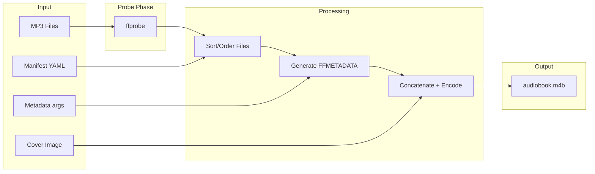

# Audiobook MP3-to-M4B Converter

## Overview

Build a Python CLI tool (Phase 1) that converts multiple MP3 files into a single M4B audiobook with auto-detected chapter markers, cover art, and rich metadata, using ffmpeg as the conversion engine. Phase 2 will layer a native macOS app on top.

## Architecture Overview



## Phase 1: Python CLI Tool

### Project Setup

- Use **uv** for project management with `pyproject.toml`
- Require **ffmpeg** and **ffprobe** installed via Homebrew (`brew install ffmpeg`)
- Dependencies: `click` (CLI framework), `mutagen` (ID3 tag reading), `pyyaml` (manifest files), `natsort` (natural filename sorting)

### Project Structure

```
audiobook/
  pyproject.toml
  README.md
  src/
    audiobook/
      __init__.py
      cli.py           # Click CLI entry point
      converter.py     # Core conversion orchestrator
      probe.py         # ffprobe wrapper (duration, bitrate, format)
      metadata.py      # ID3 reading, FFMETADATA generation, chapter building
      manifest.py      # Optional YAML manifest parsing
      models.py        # Data classes (Chapter, AudioFile, BookMetadata)
  tests/
    test_probe.py
    test_metadata.py
    test_converter.py
```

### Conversion Pipeline (core logic in `converter.py`)

1. **Discover + Probe**: Scan input path for MP3 files. Run `ffprobe -print_format json -show_format -show_streams` on each to extract duration, bitrate, sample rate, and ID3 tags.
2. **Order**: Natural-sort files by filename (using `natsort`). If a `manifest.yml` is present in the input directory (or specified via `--manifest`), use its ordering and chapter name overrides instead.
3. **Build Chapter Map**: For each MP3, compute cumulative start/end timestamps in milliseconds. Chapter names resolved in priority order: manifest override > ID3 title tag > cleaned filename (strip numbering prefixes, extensions).
4. **Generate FFMETADATA1 file**: Write a temporary metadata file in ffmpeg's chapter format:
   ```
   ;FFMETADATA1
   title=Book Title
   artist=Author Name
   album=Book Title
   genre=Audiobook
   composer=Narrator Name
   date=2025
   description=Book description

   [CHAPTER]
   TIMEBASE=1/1000
   START=0
   END=1845000
   title=Chapter 1 - The Beginning
   ```
5. **Concatenation**: Write a temporary ffmpeg concat file listing all MP3 inputs.
6. **Encode**: Run ffmpeg to concatenate, transcode to AAC, apply chapters, and embed cover art in a single pass:
   ```
   ffmpeg -f concat -safe 0 -i filelist.txt \
          -i metadata.txt \
          -i cover.jpg \
          -map 0:a -map 2:v \
          -c:a aac -b:a {bitrate} -ar 44100 \
          -c:v copy -disposition:v attached_pic \
          -map_metadata 1 -map_chapters 1 \
          output.m4b
   ```
7. **Quality Strategy**: Detect max input bitrate via ffprobe. Use AAC at the same bitrate (AAC is ~30% more efficient than MP3, so same bitrate = no quality loss). Floor at 64kbps, cap at 256kbps.

### CLI Interface (`cli.py` via Click)

Two commands under a Click group:

**Command 1: `audiobook init`** -- Generate a pre-filled manifest from MP3s

```
audiobook init INPUT_PATH [OPTIONS]
```

- `INPUT_PATH` -- Directory containing MP3 files
- `-o, --output` -- Output manifest path (default: `INPUT_PATH/manifest.yml`)

This command will:

1. Scan the directory for MP3 files
2. Natural-sort them by filename
3. Probe each file with ffprobe + mutagen for duration and ID3 tags
4. Auto-detect a cover image (first `.jpg` or `.png` found in the directory)
5. Write a `manifest.yml` pre-filled with:
   - `title`, `author`, `narrator`, `series`, `year`, `genre`, `description` -- populated from ID3 tags if consistent across files, otherwise left as empty strings for the user to fill in
   - `cover` -- auto-populated if an image file is found in the directory
   - `chapters` -- each entry with `file`, `title` (from ID3 title tag or cleaned filename), and a `duration` comment for reference
6. Print a summary: "Generated manifest.yml with N chapters. Edit it to customize chapter names and metadata, then run `audiobook convert`."

**Command 2: `audiobook convert`** -- Convert MP3s to M4B

```
audiobook convert INPUT_PATH [OPTIONS]
```

- `INPUT_PATH` -- Directory of MP3s or glob pattern
- `-o, --output` -- Output .m4b file path (default: `./audiobook.m4b`)
- `--title` -- Book title
- `--author` -- Author name
- `--narrator` -- Narrator name
- `--series` -- Series name
- `--year` -- Publication year
- `--genre` -- Genre (default: "Audiobook")
- `--description` -- Book description
- `--cover` -- Path to cover image (jpg/png)
- `--manifest` -- Path to YAML manifest (auto-detected if `manifest.yml` exists in INPUT_PATH)
- `--dry-run` -- Show chapter map and metadata without converting
- `--verbose` -- Verbose ffmpeg output

CLI flags override manifest values, so you can use `init` to generate a manifest, edit it, and still override individual fields at convert time.

### Intended Workflow

```
# Step 1: Generate manifest from your MP3s
audiobook init ./my-audiobook-mp3s/

# Step 2: Edit the manifest (fix chapter names, add metadata)
vim ./my-audiobook-mp3s/manifest.yml

# Step 3: Convert (manifest auto-detected in directory)
audiobook convert ./my-audiobook-mp3s/ -o "My Great Book.m4b"
```

### Manifest File Format (`manifest.yml`)

```yaml
# Generated by: audiobook init ./my-audiobook-mp3s/
# Edit this file to customize your audiobook, then run:
#   audiobook convert ./my-audiobook-mp3s/

title: "The Great Novel"        # from ID3 album tag, or fill in manually
author: "Jane Author"           # from ID3 artist tag, or fill in manually
narrator: ""                    # fill in manually
series: ""                      # fill in manually
year: "2024"                    # from ID3 year tag, or fill in manually
genre: "Audiobook"
description: ""                 # fill in manually
cover: "cover.jpg"              # auto-detected from directory

chapters:
  - file: "01_intro.mp3"
    title: "Introduction"       # from ID3 title tag
    duration: "5:23"            # read-only reference, not used in conversion

  - file: "02_chapter1.mp3"
    title: "The Journey Begins" # from ID3 title tag
    duration: "32:07"

  - file: "03_chapter2.mp3"
    title: "Chapter 2"          # from filename (no ID3 title found)
    duration: "28:45"
```

### Key Implementation Details

- **ffprobe wrapper** (`probe.py`): Runs `ffprobe` as subprocess, parses JSON output. Returns dataclass with duration_ms, bitrate, sample_rate, and ID3 tags.
- **Mutagen fallback** (`metadata.py`): If ffprobe ID3 parsing is incomplete, use `mutagen` to read MP3 ID3v2 tags directly for chapter names.
- **Temp file management**: Use Python's `tempfile` module for concat lists and metadata files; clean up on completion or error.
- **Progress reporting**: Parse ffmpeg stderr for time progress, display a simple progress bar via Click's `click.progressbar` or print percentage updates.
- **Error handling**: Validate ffmpeg/ffprobe are on PATH at startup. Validate all input files exist and are valid MP3s. Fail fast with clear error messages.

## Implementation Todos

1. Initialize uv project with pyproject.toml, dependencies (click, mutagen, pyyaml, natsort), and src layout
2. Create data models (AudioFile, Chapter, BookMetadata) in models.py
3. Build ffprobe wrapper in probe.py - extract duration, bitrate, sample rate, ID3 tags from MP3 files
4. Build metadata module - ID3 tag extraction via mutagen, FFMETADATA1 chapter file generation, chapter name resolution logic
5. Build manifest module - YAML manifest parsing for custom ordering and chapter name overrides
6. Build `init` CLI command - scans MP3s, probes metadata, writes pre-filled manifest.yml with chapters, auto-detected cover, and placeholder metadata fields
7. Build core converter orchestrator - file discovery, ordering, concat file generation, ffmpeg invocation, cover art embedding, temp file management
8. Build Click CLI with all flags for the `convert` command
9. Implement --dry-run mode that displays the chapter map and metadata without running conversion
10. Add tests for probe, metadata generation, chapter calculation, and manifest parsing
11. Write README with installation instructions, usage examples, and manifest format documentation

## Phase 2: macOS Application (Future)

Once the CLI is proven and stable:

- Wrap the Python conversion engine in a native **Swift + SwiftUI** macOS app
- Bundle ffmpeg binary inside the `.app` for self-contained distribution
- Drag-and-drop MP3 file import
- Visual chapter list editor (reorder, rename chapters before conversion)
- Cover art preview
- Progress bar during conversion

This phase will be planned in detail after Phase 1 is complete.
